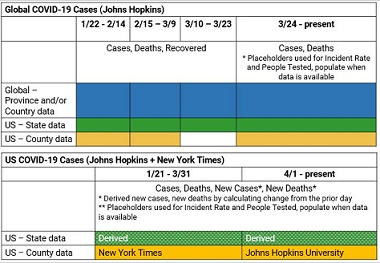

# City of LA COVID-19 Dashboard README

Contents
* [COVID-19 Case Data](#covid-19-case-data)
* [Homeless Shelter Data](#shelter-data)

## COVID-19 Case Data

The Johns Hopkins Center for Systems Science and Engineering has open sourced data culled from the US CDC, World Health Organization, DXY (China), China CDC (China), Hong Kong Department of Health, Macau Government, Taiwan CDC, European CDC, Government of Canada, Australia Government Department of Health, and other local, state, and regional health authorities. The team at JHU has [written a blog](https://systems.jhu.edu/research/public-health/ncov/) about their efforts in providing real-time information in the face of a global public health emergency.

JHU initially published US county-level data until 3/10/2020. On 3/10, JHU started publishing only US state level data ([GitHub issue](https://github.com/CSSEGISandData/COVID-19/issues/382)). As a result, there is a major gap in JHU's county time-series data between 3/10-3/23, until they started publishing county-level data again on 3/24 ([GitHub issue](https://github.com/CSSEGISandData/COVID-19/issues/1250)). Recently, the New York Times made their [county time-series data available on GitHub](https://github.com/nytimes/covid-19-data). The NYT schema used cleaner and simpler geography naming conventions than JHU, but lacked latitude/longitude information. JHU provided hourly updates, while the NYT data was always a day behind. Through all of JHU's schema changes, the US observations were most affected, while the global observations maintained a fairly consistent schema (illustrated below).

### Important JHU and NYT Source Materials
* [JHU Dashboard](https://www.arcgis.com/apps/opsdashboard/index.html#/bda7594740fd40299423467b48e9ecf6)

* [JHU ESRI feature layers for global province and country data](https://www.arcgis.com/home/item.html?id=c0b356e20b30490c8b8b4c7bb9554e7c)

* [JHU ESRI feature layer for US county data](https://www.arcgis.com/home/item.html?id=628578697fb24d8ea4c32fa0c5ae1843) and [blog post](https://www.esri.com/arcgis-blog/products/product/public-safety/coronavirus-covid-19-data-available-by-county-from-johns-hopkins-university/)

* [JHU COVID-19 GitHub repo](https://github.com/CSSEGISandData/COVID-19)

* [JHU geography lookup table](https://github.com/CSSEGISandData/COVID-19/blob/master/csse_covid_19_data/UID_ISO_FIPS_LookUp_Table.csv)

* [NYT COVID-19 GitHub repo](https://github.com/nytimes/covid-19-data)

### City of LA Workflow

**4/1/2020 update:** To reconcile the mutiple schemas from JHU and NYT, we use Aqueduct, our shared pipeline for building ETLs and scheduling batch jobs. We create one table for the US and one for the rest of the world, called *global*:

* **Global:** Use JHU province-level time-series data. The US is a singular observation as a country. Smaller countries report only country-level data, while larger countries like China, Australia, and Canada include province-level data.
* **US:** Use NYT county-level time-series data up through 3/31. Then, schedule a job that pulls JHU county-level time-series data (which is updated hourly). Append those into one time-series dataset and calculate state totals.

Our ETLs check JHU data ***every hour***.

### Important City of LA Source Materials

* [City of LA COVID-19 Dashboard](http://lahub.maps.arcgis.com/apps/opsdashboard/index.html#/f1c6c7f54f964900aacfa6b76b99eb62)

* [Global province-level time-series feature layer](http://lahub.maps.arcgis.com/home/item.html?id=20271474d3c3404d9c79bed0dbd48580)

* [Global province-level current date's feature layer](http://lahub.maps.arcgis.com/home/item.html?id=191df200230642099002039816dc8c59)

* [US county-level time-series feature layer](http://lahub.maps.arcgis.com/home/item.html?id=4e0dc873bd794c14b7bd186b4b5e74a2)

* [City of LA's COVID-19 ETL](https://github.com/CityOfLosAngeles/aqueduct/tree/master/dags/public-health/covid19/), specifically the `jhu-to-esri.py` and `jhu-county-to-esri.py` scripts.

* [LA County Dept of Public Health neighborhood-level current date's feature layer](http://lahub.maps.arcgis.com/home/item.html?id=999b5d0dbe2742bc92cfb126a33ff057)

Soon-to-be-deprecated (created because of our 3/13 update below) -

* [SCAG Region county level time-series feature layer](http://lahub.maps.arcgis.com/home/item.html?id=d61924e1d8344a09a1298707cfff388c)

* [SCAG Region county level current date's feature layer](http://lahub.maps.arcgis.com/home/item.html?id=523a372d71014bd491064d74e3eba2c7)

We believe that open source data will allow policymakers and local authorities to monitor a rapidly changing situation. It will prevent other entities from "reinventing the wheel"; we welcome collaboration and pull requests on our work!

### Prior Updates to Workflow
**3/13/2020 update:** JHU's CSVs will be at the state level, and not at the city/county level anymore, [as noted in their GitHub issue](https://github.com/CSSEGISandData/COVID-19/issues/382). Since JHU's feature layers weren't connecting to our dashboard, we adapted our ETL to continue to grab province/state level data for the world and will publish these as 2 public ESRI feature layers (#1, #2). Our ETL checks JHU data ***every hour***.

In addition, we are scraping the websites for Southern California counties belonging in the Southern California Association of Governments (SCAG) region. We have data from [Los Angeles](http://publichealth.lacounty.gov/media/Coronavirus/), [Orange County](http://www.ochealthinfo.com/phs/about/epidasmt/epi/dip/prevention/novel_coronavirus), and [Imperial](http://www.icphd.org/health-information-and-resources/healthy-facts/covid-19/) Counties. In the coming days, we will add [Ventura](https://www.ventura.org/covid19/), [Riverside](https://www.rivcoph.org/coronavirus), and [San Bernardino](http://wp.sbcounty.gov/dph/coronavirus/) Counties. We have combined JHU county data up to 3/12/2020 with our own compilation of counts, and will publish these as 2 public ESRI feature layers (#3, #4). Our ETL scrapes case counts published by county public health agency websites ***every hour***.

1. Worldwide time-series data available at the state level of confirmed cases, deaths, and recovered.
2. Worldwide *current date's* data available at the state level of confirmed cases, deaths, and recovered.
3. SCAG Region time-series data available at the county level of confirmed cases, travel-related cases, and community spread cases. Not all counties report the breakdown due to travel vs. community spread, but we grab it if it's available.
4. SCAG Region *current date's* data available at the county level of confirmed cases, travel-related cases, and community spread cases.

**3/12/2020 update:** JHU publishes new CSVs daily with city/county level counts for the world. Starting from 3/10/2020, the JHU dataset includes both county-level and state-level observations. [JHU GitHub issue discussing this change.](https://github.com/CSSEGISandData/COVID-19/issues/559) We schedule our ETL around these CSVs made available on GitHub and repackage them into 2 public ESRI feature layers:
1. Time-series data available at the city/county level of confirmed cases, deaths, and recovered.
2. The *current date's* city/county data of confirmed cases, deaths. In the coming days, we hope to update or publish a new feature layer that contains the state's and country's total cases, deaths, and recovered.

### Disclaimer
We are using the Johns Hopkins and New York Times data for our ETL and ESRI feature services. The Johns Hopkins University disclaimer is below:

This website and its contents herein, including all data, mapping, and analysis (“Website”), copyright 2020 Johns Hopkins University, all rights reserved, is provided to the public strictly for educational and academic research purposes. The Website relies upon publicly available data from multiple sources, that do not always agree. The names of locations correspond with the official designations used by the U.S. State Department, including for Taiwan. The Johns Hopkins University hereby disclaims any and all representations and warranties with respect to the Website, including accuracy, fitness for use, and merchantability. Reliance on the Website for medical guidance or use of the Website in commerce is strictly prohibited.

## Shelter Data

The DAG `shelter-to-esri.py` takes the Rec & Parks (RAP) shelter census (collected at 8 intervals a day) and pushes it into the City of LA GeoHub by merging it with the the official shelter data from LA Sanitation (LASAN) and RAP GIS staff. The report intervals are: 6:30am, 10:30am, 11:30am, 12:30pm, 1:30pm, 2:30pm, 3:30pm, 4:30pm, and 8:30pm. We do some timezone data cleaning and publish.

`Timestamp` is the time in which the shelter actually submitted the Google form. `Date` and `Time` are which "report" they are filing for.

Note, the capacity numbers should be calculated by `sum(occupied beds + unoccupied beds)`, rather than the normal capacity, which has been lower to help adhere to social distancing in the shelters.

There are 3 layers you can use to access shelter data.

* [Shelter Timeseries](http://lahub.maps.arcgis.com/home/item.html?id=2085cb061b834faf9fa5244b033b41ec) - is a representation of the form data combined with known geospatial information, with minimal transformations.

* [Shelter Current](http://lahub.maps.arcgis.com/home/item.html?id=1b73a44e811549ec8952a1ff24e51cd0) - is the most recent report for each shelter, along with computed occupancy numbers.

* [Shelter Stats](http://lahub.maps.arcgis.com/home/item.html?id=8679b3973d254aca9e247ffa85b012dd) - is a table that has 2 data points, the number of unique shelters in the entire dataset and the number of unique shelters that filed reports in the last 24 hours. Either of these can be used to produce open shelter numbers.

## Contributors
* [Hunter Owens](https://github.com/hunterowens)
* [Ian Rose](https://github.com/ian-r-rose)
* [Tiffany Chu](https://github.com/tiffanychu90)
